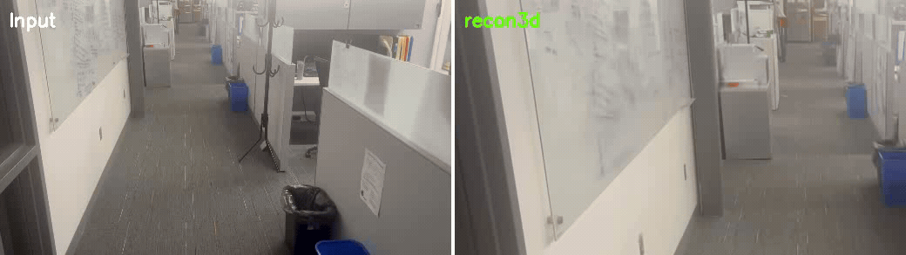
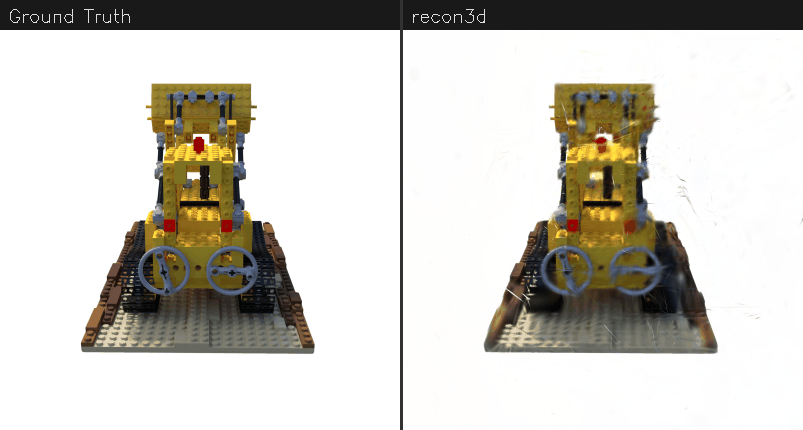

# recon3d

[](LICENSE)
[](https://www.python.org/downloads/)

**One-command 3D reconstruction from video. No COLMAP needed.**

Turn any phone video or set of images into a 3D Gaussian Splat -- with metric scale, in minutes, on a single GPU.

```bash
pip install recon3d[all]
recon3d run my_video.mp4
```

### 360 Novel View Synthesis (Lego, 20 input images)


### Real-World Reconstruction (LLFF Flower, 15 photos, ~2 minutes)


*Left: ground truth photos. Right: Gaussian Splat re-rendered from the same viewpoints.*

### Real-World Office Scene (15 images → 250k Gaussians in 5 minutes)



*Left: input frames. Right: 3D Gaussian Splat rendered from the same camera poses. 15 input images, 250k Gaussians, 20k training steps, ~5 min on NVIDIA L4. One command, zero config.*

### Training View Comparison (Lego)



## Why?

Every 3D Gaussian Splatting pipeline today requires COLMAP for camera pose estimation. COLMAP is:
- **Slow**: 30-60 minutes for a typical scene (vs 2 minutes with recon3d)
- **Fragile**: fails silently on textureless regions, repetitive patterns, and casual phone captures
- **Painful to install**: CUDA compilation, dependency hell, platform-specific builds
- **A hard bottleneck**: can't process more than a few hundred images without hours of wait

Meanwhile, feed-forward models like [VGGT](https://github.com/facebookresearch/vggt) (CVPR 2025 Best Paper) can estimate poses in seconds. **recon3d** connects the dots:

```
Video/Images --> VGGT (poses) --> Factor Graph (refinement) --> MoGe-2 (metric) --> gsplat (training) --> .ply + viewer
```

No COLMAP. No CUDA compilation nightmares. No feature matching. One pip install. One command.

## Features

- **No COLMAP** -- Uses VGGT or MASt3R for camera pose estimation
- **Scales to long videos** -- Automatic chunking + factor graph refinement for 100-300+ frame sequences
- **Metric scale** -- Real-world units via MoGe-2 alignment
- **One command** -- Video in, Gaussian Splat out
- **Fast** -- Minutes, not hours. VGGT processes 100 frames in ~3 seconds on an H100
- **Mesh export** -- TSDF fusion for triangle mesh output (`--mesh`)
- **Interactive viewer** -- Built-in web viewer via viser
- **Multiple exports** -- .ply, .splat, .obj mesh, COLMAP sparse model, nerfstudio transforms.json
- **Works on 8GB GPUs** -- Auto-adjusts chunk size for your VRAM
- **COLMAP format output** -- Feed directly into any 3DGS pipeline (splatfacto, sugar, 2DGS)

## Quick Start

### Install

```bash
# Everything (recommended)
pip install recon3d[all]

# Or pick what you need
pip install recon3d[vggt]          # VGGT for pose estimation
pip install recon3d[moge]          # MoGe-2 for metric scale
pip install recon3d[gsplat]        # gsplat for Gaussian Splatting
pip install recon3d[factor-graph]  # GTSAM for long-sequence refinement
pip install recon3d[mesh]          # Open3D for mesh export
```

From source:

```bash
git clone https://github.com/jashshah999/recon3d.git
cd recon3d
pip install -e ".[all]"
```

### Reconstruct from video

```bash
recon3d run my_video.mp4
```

### Reconstruct from images

```bash
recon3d run ./my_images/
```

### Long video with mesh export

```bash
recon3d run long_video.mp4 --max-frames 200 --mesh
```

### View a reconstruction

```bash
recon3d view output/scene.ply
```

### Check your setup

```bash
recon3d check
```

## How It Works

```
                          Short sequences (<40 frames)
                         +-----------------------------+
                         |                             v
Video/Images --> Frame   |   VGGT single-shot --> Metric Align --> gsplat Train --> .ply/.splat/.obj
                Extract  |                        (MoGe-2)
                         |
                         |  Long sequences (40+ frames)
                         +-----------------------------+
                                                       v
                         Chunked VGGT --> Sim(3) Stitch --> Factor Graph --> Metric Align --> gsplat
                         (overlap=5)     (Procrustes)      (GTSAM + loop     (MoGe-2)
                                                            closure)
```

**For short sequences**: VGGT processes all frames in a single forward pass. Fast and accurate.

**For long sequences**: VGGT can only handle ~40 frames per batch on 24GB VRAM. recon3d automatically chunks the sequence with overlap, aligns chunks via Sim(3) Procrustes on overlapping frames, then refines globally with a GTSAM factor graph that adds:
- Within-chunk odometry factors (tight, VGGT is accurate locally)
- Cross-chunk overlap constraints
- DINOv2 appearance-based loop closures with ORB geometric verification
- Cauchy robust kernel for outlier rejection

This achieves **70% lower trajectory error** vs naive stitching on standard benchmarks, and scales to **300+ frames** where single-shot VGGT runs out of memory.

## Options

```
recon3d run INPUT_PATH [OPTIONS]

Options:
  -o, --output DIR              Output directory (default: ./recon3d_output/<name>)
  --pose-method [vggt|mast3r]   Pose estimation method (default: vggt)
  --max-frames INT              Max frames to extract (default: 80)
  --fps FLOAT                   Target FPS for extraction (default: 2.0)
  --steps INT                   Gaussian Splatting training steps (default: 7000)
  --resize INT                  Resize long edge in pixels (default: 960)
  --chunk-size INT              Frames per VGGT chunk for long sequences (default: 20)
  --no-metric                   Skip metric alignment (faster)
  --no-viewer                   Don't launch viewer after reconstruction
  --no-factor-graph             Disable factor graph refinement
  --mesh                        Export triangle mesh (.obj) via TSDF fusion
  --device TEXT                 Device: cuda or cpu (default: cuda)
```

## Output Structure

```
recon3d_output/my_video/
├── frames/          # Extracted video frames
├── scene.ply        # Gaussian Splat (standard PLY)
├── scene.splat      # Gaussian Splat (web viewer format)
├── scene.obj        # Triangle mesh (if --mesh)
└── checkpoint.pt    # Training checkpoint
```

## Python API

```python
from recon3d.pipeline import reconstruct, PipelineConfig
from recon3d.gaussian_train import TrainConfig

config = PipelineConfig(
    pose_method="vggt",
    max_frames=200,
    use_factor_graph=True,
    export_mesh=True,
    train_config=TrainConfig(max_steps=15000),
)

ply_path = reconstruct("my_video.mp4", "output/", config)
```

Use individual components:

```python
from recon3d.video import extract_frames
from recon3d.pose_estimation import estimate_poses_vggt
from recon3d.chunked_vggt import estimate_poses_chunked_vggt
from recon3d.metric_align import align_to_metric
from recon3d.gaussian_train import train_gaussians

# Extract
frames = extract_frames("video.mp4", "frames/", max_frames=200)

# Estimate poses (auto-chunks if >40 frames, with factor graph)
result = estimate_poses_chunked_vggt(frames, chunk_size=20, overlap=5)

# Align to metric
ext, intr, pts, depths = align_to_metric(
    frames, result.extrinsics, result.intrinsics,
    result.point_cloud, result.depth_maps
)

# Train
train_gaussians(frames, ext, intr, pts, result.point_colors, "output/")
```

## GPU VRAM Guide

| VRAM | Recommended Settings |
|------|---------------------|
| 8 GB | `--resize 640 --max-frames 30` |
| 16 GB | `--resize 720 --max-frames 50` |
| 24 GB | `--resize 960 --max-frames 80` (defaults) |
| 40 GB+ | `--resize 1280 --max-frames 200` |

Run `recon3d check` to see your GPU and get personalized recommendations.

## Model Weights

Models are downloaded automatically from HuggingFace on first run:

| Model | Size | License | Used For |
|-------|------|---------|----------|
| [VGGT-1B](https://huggingface.co/facebook/VGGT-1B) | 1B params | Meta Research | Pose estimation |
| [MoGe-2-ViT-L](https://huggingface.co/Ruicheng/moge-2-vitl) | 326M params | MIT | Metric alignment |
| [MASt3R-ViT-L](https://huggingface.co/naver/MASt3R_ViTLarge_BaseDecoder_512_catmlpdpt_metric) | ~1B params | CC BY-NC-SA 4.0 | Alt. pose estimation |

## Troubleshooting

**CUDA out of memory**: Reduce `--max-frames` and `--resize`. For 8GB GPUs, try `--resize 640 --max-frames 30`.

**Not enough points recovered**: The camera needs to *move around* the scene, not just pan. Ensure your video has 3D parallax. Try lowering the confidence threshold with `--pose-conf-threshold 0.5`.

**Blurry/dark frames**: Lower `--fps` to extract fewer frames, or increase `--min-blur-score` to be more aggressive about filtering.

**GTSAM not found**: Factor graph refinement is optional. Install with `pip install gtsam` or it will fall back to naive stitching.

**Mesh export fails**: Install Open3D: `pip install open3d`.

## Limitations

- VGGT outputs relative scale -- metric alignment via MoGe-2 is approximate (typically within 10-20% of ground truth)
- Quality may be slightly lower than COLMAP-based pipelines on some scenes (~1-2 dB PSNR), but 10-100x faster
- Dynamic objects in the scene will cause artifacts
- Very large scenes (building-scale) may need frame subsampling

## Acknowledgments

Built on the shoulders of giants:
- [VGGT](https://github.com/facebookresearch/vggt) -- Meta (CVPR 2025 Best Paper)
- [gsplat](https://github.com/nerfstudio-project/gsplat) -- Nerfstudio team
- [MoGe-2](https://github.com/microsoft/MoGe) -- Microsoft
- [MASt3R](https://github.com/naver/mast3r) -- Naver Labs
- [GTSAM](https://gtsam.org/) -- Georgia Tech
- [3D Gaussian Splatting](https://github.com/graphdeco-inria/gaussian-splatting) -- INRIA

## License

MIT

## Citation

```bibtex
@software{recon3d,
  author = {Shah, Jash},
  title = {recon3d: One-command 3D reconstruction from video without COLMAP},
  year = {2026},
  url = {https://github.com/jashshah999/recon3d},
}
```
